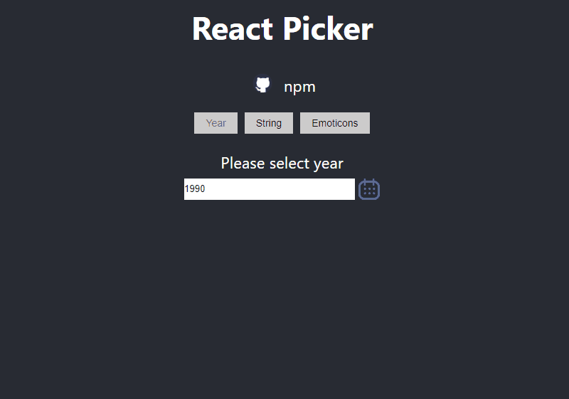

# React single Year Picker

>A Year picker component or picker for React.
>Check out the [Demo](https://react-year-picker.firebaseapp.com/).


## Quick Overview


`npm install react-single-year-picker --save`
`yarn install react-single-year-picker --save`

```sh
import React, { useState } from 'react';
import YearPicker from 'react-single-year-picker'

const App = () => {
  const [yearSelected, setYear] = useState(1990);
  return (
    <div>
      <YearPicker
        yearArray={['2019', '2020']}
        value={yearSelected}
        onSelect={(e) => setYear(e)}
        hideInput={false}
        activeIcon={src url}
        icon={src url}
        leftIcon={src url}
        rightIcon={src url}
        minRange={1000}
        maxRange={2018}
      />
    </div>
  );
}
```
## Description
* *React-single-year-picker*  Component can be used as a Year picker as well as react-picker also, only just need to pass the array and then all elements will be displayed in the calendar format may be array contains *image/string/emoticons*, etc. whichever type of value want to pick from an array this will be helpful for you.
* Just pass an array and then open component then select or click any of element then it will return you the selected value from an array which is getting from *onSelect*  prop.

```onSelect={(e) => console.log(e)}
Output: Selected value like 2019.
```


## Note
* Input element is used only for just demo purpose in it to display results, The main component is open on click of Calendar icon. 
 
## Props

* *yearArray*: Array of year or any type of array you want to access.
* *onSelect*: on item click event.
* *hideInput*: By default it is false and if you want to hide input element please set true.
* *activeIcon*: This props is for Calendar Icon, accept Image or Icon src url.
* *icon*: Inactive calendar icon, accept Image or Icon src url.
* *leftIcon*: Picker left icon, accept Image or Icon src url.
* *rightIcon*: Picker right icon, accept Image or Icon src url.
* *minRange*: Min range of the year picker and this is only used for years.
* *maxRange*: Max range of the year picker and this is only used for years.
